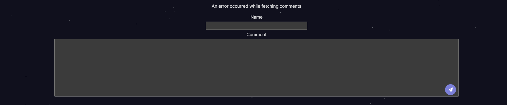
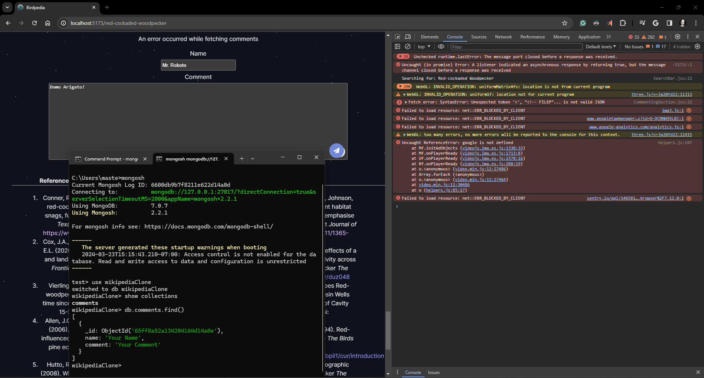
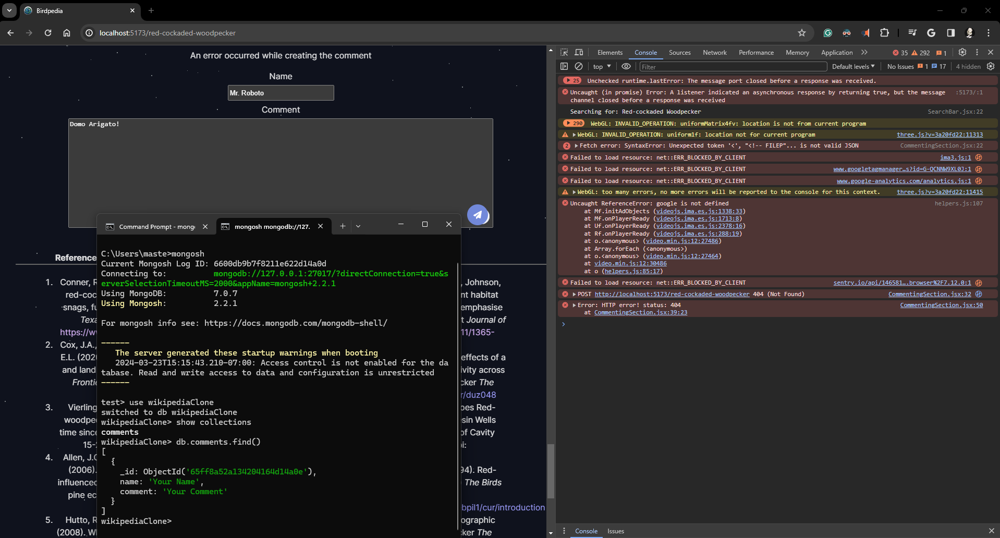

# Wikipedia Clone - Birdpedia edition
A from scatch React Wikipediaclone practice project that teaches me the intricacies of the library and Javascript. I focused on multiple elements that I required practice in like creating components, building/deploying, and file management. Though the project was mostly successful, I did run into some pitfalls.

## Instructions to Run

To run the project, follow these steps:

1. Clone the repository using Git:

``
git clone https://github.com/DogeLovesHipster/DogeLovesHipster.github.io
``

2. Navigate to the server folder and install the dependencies:

``
cd server
npm install
``

3. Navigate back to the main folder and install the dependencies:

``
cd ..
npm install
``

4. Start the development server for the server folder:

``
cd server
npm run dev
``

5. In a separate terminal, start the development server for the main folder:

``
cd ..
npm run dev
``

6. To build the project for production, run the following command in the main folder:

``
npm run build
``

7. Finally, to deploy the project on GitHub Pages, run:

``
npm run deploy
``
___

### Connecting MongoDB backend with comment component
Along the way, I wanted to include a commenting system in the form of a component that connects to my backend to display comments from users. Though this problem proved difficult with my experience. After spending countless hours trying to debug the particular bug, I was unable to solve it. I tried multiple methods of trying to solve it, but I was only able to get more of an understanding of the rest of the code and how backend functions rather than solving the bug.

My process was figuring out if I followed the example from lab9 and if my machine was at fault, which after a clean install, I determined that was not the case. I was able to get lab9 to connect the frontend and backend on a completely different machine that I ran completed it for the submission on Moodle.

I then did some searching using Copilot, GPT, Stackoverflow, and other forums to see where other's might have solved a similar issue. Alongside my previous knowledge of what that type of error means. 

I switched over from Axios to a different method. I tried redoing my code to look more like the Lab9 example. I moved the commenting component to a different page (my home route /) instead of having it one a different page, which gave the same issues/bugs. I did the old reliable method of printing everything to the console and to the screen. I also tried adding files that I may have missed and tried a multitude of other fixes.

I've just come to the conclusion that I just need more practice working with connecting the backend to the frontend in general! I understand how to work with each of them seperately, but I seem to have difficulty connecting them with each other to work with each other. Especially on a project I built completely on my own using React + Vite. I even tried to see if Postman might be able to tell me something.

I'll provide the images of my errors below to see what I came across at the point I decided to call it. It just seems to be a 404 error with my frontend unable to locate my backend. Which is an error I do not know how to solve easily.

### My conclusion

I'm submitting my code without the backend fully connected, but leaving the code in as. It will contain all my attempted code and fixes, but it fully not working because I want to show the amount of time and effort I put in trying to make it to work. I also included a few comments in my code to explain where I think the problem may be. I think I'm already growing tired with the amount of time and effort I put in this project, so I think this is a good place to leave it. I learned a lot.

